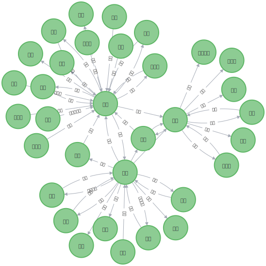

# KGQA-people_relation

基于知识图谱的人物关系问答系统

数据来源：[老刘说NLP作者的一个仓库中的人物关系数据集](https://github.com/liuhuanyong/PersonRelationKnowledgeGraph/blob/master/EventMonitor/rel_data.txt)

TODO

---

- [X]  找数据、处理数据 -21\12\23
- [X]  构建知识图谱 -21\12\24
- [ ]  定义关系问题，构建模板
- [ ]  编写问答脚本

图谱展示：

