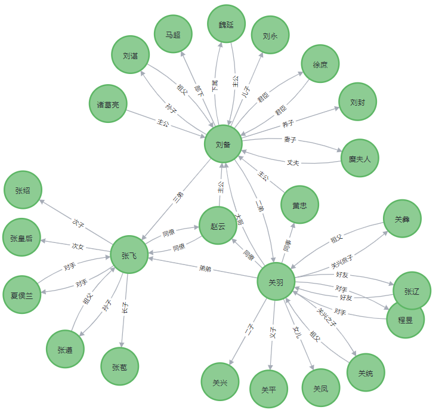

# KGQA-people_relation

基于知识图谱模板匹配的桃园三结义人物关系问答系统

数据来源：[老刘说NLP作者的一个仓库中的人物关系数据集](https://github.com/liuhuanyong/PersonRelationKnowledgeGraph/blob/master/EventMonitor/rel_data.txt)

TODO

---

- [X]  找数据、处理数据 -21\12\23
- [X]  构建知识图谱 -21\12\24
- [X]  定义关系问题，构建模板 -21\12\24
- [X]  编写问答脚本 -21\12\24
- [ ]  重构，添加一点问题，完善问答的鲁棒性


图谱展示：



# 一，项目使用

## 1.下载

`git clone git@github.com:eat-or-eat/KGQA-people_relation.git`

## 2.（可选）添加自己的数据

将数据处理成`/data/rel_data.txt`的txt格式（实体###关系###实体）

```bash
eg:
三毛###贾平凹###好友###2
袁买###袁熙###哥哥###
。。。

```

`

## 3.运行

1. 建图

`python build_graph.py`

2. 问答

`python qa_by_template_match.py`

问答效果展示：

```bash
       桃园三结义人物关系知识图谱加载完毕！
        可以查询桃园三结义的相关人物关系~
  
请输入您想问的问题：>? 关羽和赵云的关系
同僚
请输入您想问的问题：>? 刘备和张飞的关系
三弟
请输入您想问的问题：>? 黄忠和刘备的关系
主公
请输入您想问的问题：>? 张皇后和貂蝉的关系
对不起，没有合适的答案
```

# 二，项目介绍

```bash
│  build_graph.py  # 建图脚本
│  config.py
│  qa_by_template_match.py  # 问答流程脚本，流程有点复杂
│  README.md
│  requirements.txt
│
├─cyphermark  # 简单记录用到的cypher语句
│      README.md
│
├─data  # 数据文件夹
│      rel_data.txt  # 老刘NLP作者的一个github中的数据集
│      triplet_data.txt  # 提取所需桃园三结义人物数据
│
├─output  # 输出的文件
│      graph.png  # 建图后导出的图片
│
├─src  # 核心流程文件夹
│      kg_data.json  # 暂存的知识图谱数据
│      loader.py  # 后面重构用的，目前没写东西
│      prepare_data.py  # 数据集预处理
│      template.xlsx  # 待匹配的模板
```
